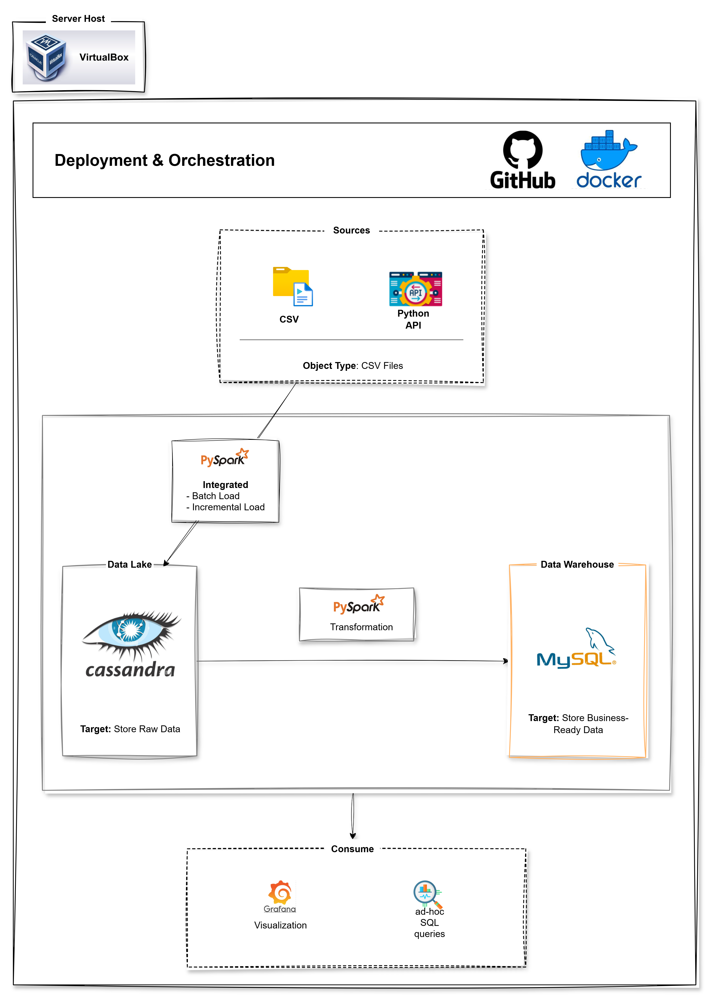
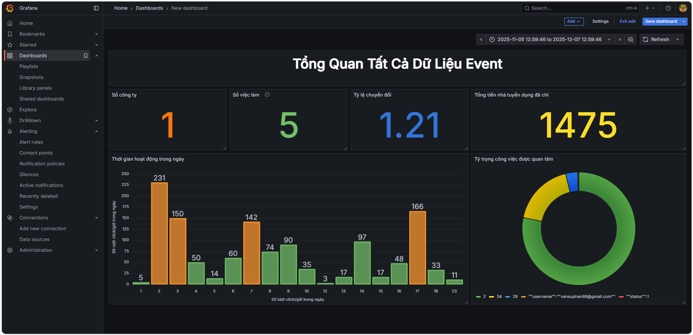
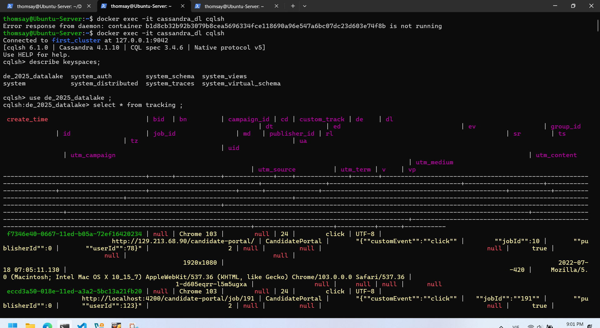
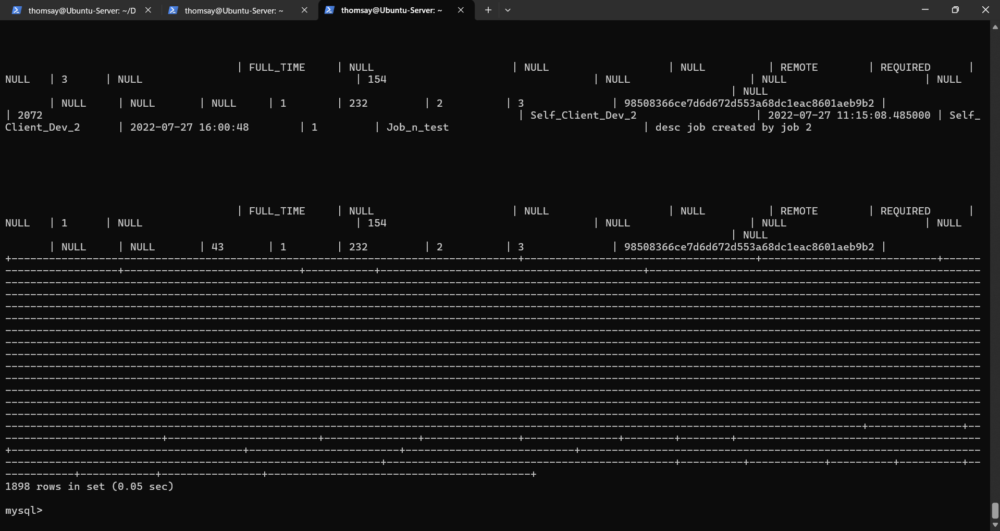
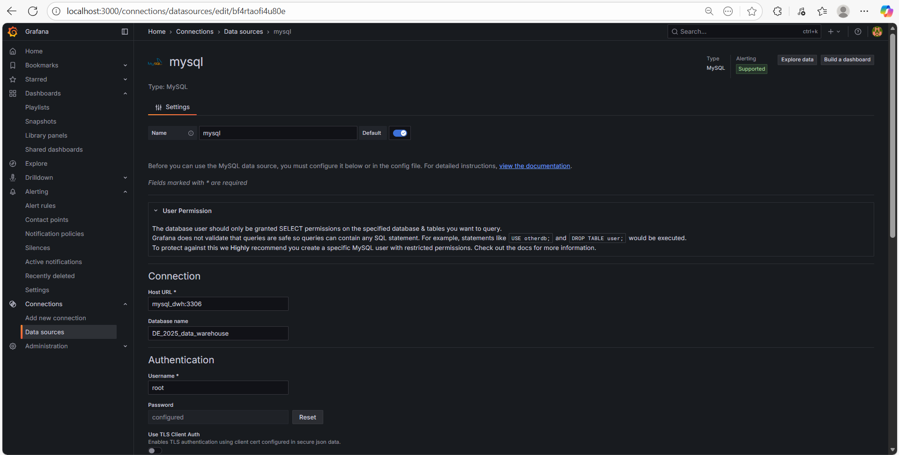
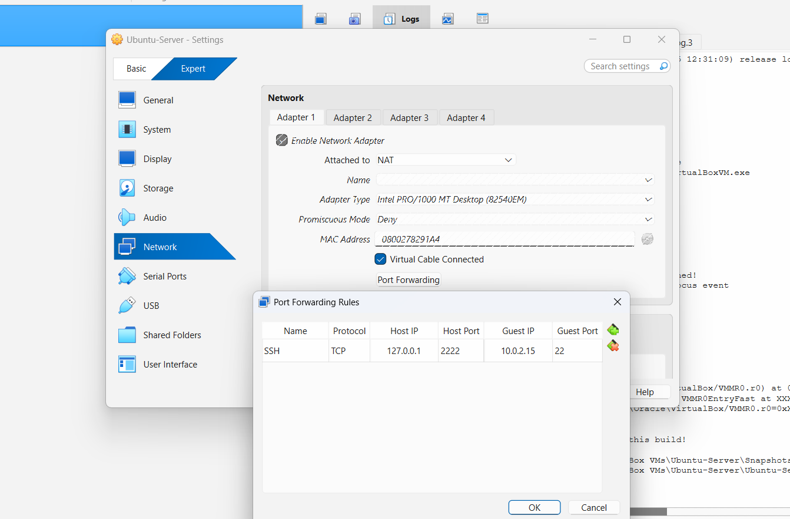
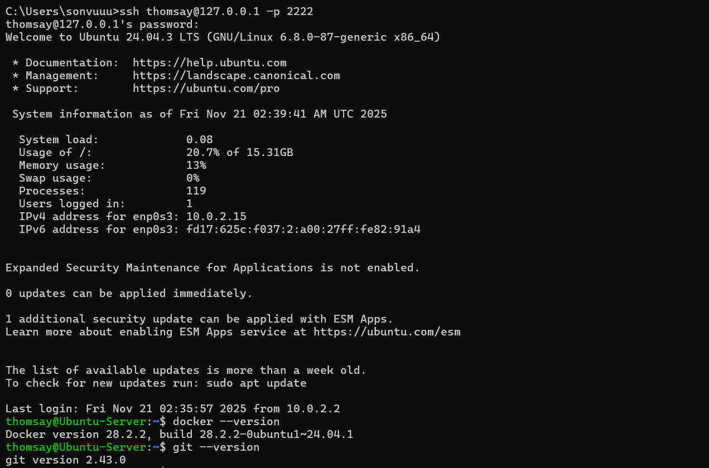
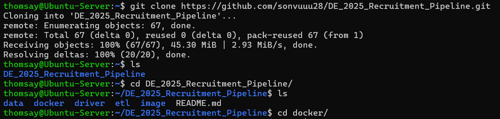
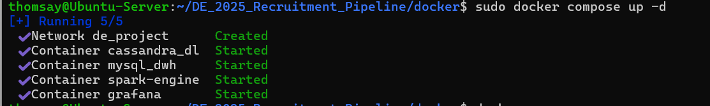

# **DE project: Recruitment Pipeline**

[](https://www.python.org/)
[](https://spark.apache.org/)
[](https://cassandra.apache.org/)
[](https://www.mysql.com/)
[](https://grafana.com/) 
[](https://www.docker.com/) 
[](https://github.com/)
---

# Mục Lục

1. [Tổng quan dự án](#tổng-quan-dự-án)
2. [I. Docker Preparation](#i-docker-preparation)
3. [II. ETL Pipeline](#ii-etl-pipeline)
4. [III. Visualization (Grafana)](#iii-visualization-grafana)
5. [IV. Server Preparation](#iv-server-preparation)
6. [V. Deployment & CI/CD](#v-deployment--cicd)
---
# Tổng quan dự án
### 1. Mục tiêu dự án
Xây pipeline Micro-Batch ETL near-real-time từ CSV tĩnh và API giả lập CDC: lưu dữ liệu thô vào Cassandra(Data Lake), transform bằng Spark + Python, load vào MySQL(Data Warehouse) và hiển thị trên Grafana.  Toàn bộ hệ thống được container hóa bằng Docker và triển khai trên một máy ảo VirtualBox, kèm CI/CD trên GitHub.

---
### 2. High Level Architecture
Dữ liệu đi từ Sources → Ingest → Data Lake (Cassandra) → ETL (Spark) → Data Warehouse (MySQL) → Consumers (Grafana / SQL). Tất cả components đều được đóng gói bằng docker và chạy trong VM.


---
### 3. Input/Output
**Input**

* File CSV tracking.
* API Python sinh sự kiện (giả lập CDC). Sanh ra bản ghi tương ứng metadata của tracking.

| Column Name    | Description |
|----------------|-------------|
| create_time    | Thời điểm event được tạo (UUID v1) |
| job_id         | ID công việc liên quan đến event |
| custom_track   | Loại event: click, conversion, qualified, unqualified |
| bid            | Giá thầu (bid) cho event |
| campaign_id    | ID chiến dịch quảng cáo |
| group_id       | ID nhóm |
| publisher_id   | ID nhà xuất bản |


**Output**

* Dashboard phân tích trên Grafana
* Pipeline ETL micro-batch tự động
* Tất cả chạy trên single VM VirtualBox
* Flat Table output:

| Column Name    | Description |
|----------------|-------------|
| id             | ID bản ghi tự sinh (unique) |
| job_id         | ID công việc liên quan đến event |
| dates          | Ngày xảy ra event (YYYY-MM-DD) |
| hours          | Giờ trong ngày khi event xảy ra (0-23) |
| company_id     | ID công ty sở hữu job/campaign |
| group_id       | ID nhóm liên quan đến job/campaign |
| campaign_id    | ID chiến dịch quảng cáo |
| publisher_id   | ID nhà xuất bản |
| click          | Số lần click |
| conversion     | Số lần chuyển đổi |
| qualified      | Số lượt qualified |
| unqualified    | Số lượt unqualified |
| bid_set        | Giá thầu trung bình |
| spend_hour     | Tổng chi tiêu theo giờ |
| sources        | Nguồn dữ liệu (ví dụ: Cassandra) |
| updated_at     | Thời điểm bản ghi được cập nhật |

---
### 4. Demo
`ETL chạy tự động liên tục`


---
`Grafana Dashboard`



---
### Kết quả trên server

`Cassandra (Data Lake) lưu dữ liệu thô`



---

`MySQL (Data Warehouse) lưu dữ liệu đã transform`



---

`Spark Engine xử lý micro-batch liên tục`


----
# I. Docker Preparation

```
docker/
├── 📁 config
│   └── ⚙️ spark-defaults.conf
├── 📁 spark
│   └── 🐳 Dockerfile
├── 📄 .env
├── ⚙️ docker-compose.yml
├── 📄 entrypoint.sh
└── 📄 requirements.txt
```

Mục tiêu: Build image Spark riêng, Cassandra và MySQL dùng image từ Docker Hub.

---

## 1. Build Spark Image

Dockerfile:

```dockerfile
FROM python:3.10-bookworm as spark-base

# Cài tool cần thiết
RUN apt-get update && \
    apt-get install -y sudo curl vim unzip rsync openjdk-17-jdk build-essential software-properties-common ssh && \
    apt-get clean && rm -rf /var/lib/apt/lists/*

# Thiết lập môi trường
ENV SPARK_HOME=/opt/spark
ENV HADOOP_HOME=/opt/hadoop
RUN mkdir -p ${SPARK_HOME} ${HADOOP_HOME}
WORKDIR ${SPARK_HOME}

# Tải Spark
RUN curl https://archive.apache.org/dist/spark/spark-3.5.6/spark-3.5.6-bin-hadoop3.tgz -o spark.tgz \
 && tar xvzf spark.tgz --strip-components 1 \
 && rm spark.tgz

# Cài Python dependencies
COPY requirements.txt .
RUN pip3 install -r requirements.txt

# Config Spark
ENV PATH="$SPARK_HOME/sbin:$SPARK_HOME/bin:$PATH"
ENV SPARK_MASTER="spark://spark-master:7077"
ENV PYSPARK_PYTHON=python3
COPY config/spark-defaults.conf $SPARK_HOME/config
RUN chmod +x $SPARK_HOME/sbin/* $SPARK_HOME/bin/*

ENV PYTHONPATH=$SPARK_HOME/python/:$PYTHONPATH

# Entrypoint
COPY entrypoint.sh .
ENTRYPOINT ["./entrypoint.sh"]
```

Lưu ý:

* Spark chạy trong container, kết nối Cassandra / MySQL từ Docker Hub.
* `entrypoint.sh` chạy ETL tự động khi container start.

---

## 2. Docker Compose Setup
docker-compose:
```yaml
services:

  # Cassandra (Data Lake)
  cassandra:
    image: cassandra:4.1
    container_name: cassandra_dl
    ports:
      - "9042:9042"
    volumes:
      - cassandra-data:/var/lib/cassandra
    environment:
      CASSANDRA_CLUSTER_NAME: "first_cluster"
    healthcheck:
      test: ["CMD-SHELL", "cqlsh -e 'describe keyspaces'"]
      interval: 10s
      retries: 5
    networks:
      - de_project

  # MySQL (Data Warehouse)
  mysql:
    image: mysql:8.0.44-debian
    container_name: mysql_dwh
    ports:
      - "3307:3306"
    environment:
      MYSQL_ROOT_PASSWORD: 123
    volumes:
      - mysql-data:/var/lib/mysql
    healthcheck:
      test: ["CMD", "mysqladmin", "ping", "-h", "localhost"]
      interval: 10s
      retries: 5
    networks:
      - de_project

  # Spark Master
  spark-master:
    container_name: spark-engine
    build:
      context: .
      dockerfile: spark/Dockerfile
    image: da-spark-image
    entrypoint: ['./entrypoint.sh', 'master']
    healthcheck:
      test: ["CMD", "curl", "-f", "http://localhost:8080"]
      interval: 5s
      timeout: 3s
      retries: 3
    volumes:
      - ../data:/opt/spark/data
      - ../etl:/opt/spark/etl
      - spark-logs:/opt/spark/spark-events
    env_file:
      - .env
    ports:
      - "9090:8080"  # Web UI
      - "7077:7077"  # Spark master
      - "4041:4040"  # Spark driver UI
    networks:
      - de_project

  # Grafana (Monitoring)
  grafana:
    image: grafana/grafana:latest
    container_name: grafana
    environment:
      - GF_SECURITY_ADMIN_USER=admin
      - GF_SECURITY_ADMIN_PASSWORD=admin
    ports:
      - "3000:3000"
    networks:
      - de_project

# Volumes
volumes:
  cassandra-data:
  mysql-data:
  spark-logs:

# Networks
networks:
  de_project:
    name: de_project
    driver: bridge
```

Giải thích:

* Cassandra → Data Lake, port 9042
* MySQL → Data Warehouse, port 3307
* Spark Master → chạy ETL, kết nối CSV/ETL code
* Grafana → Monitoring, port 3000
* Volumes → lưu dữ liệu persistent
* Network de_project → tất cả container cùng network nội bộ

---

# II. ETL Pipeline
```
├── 🐍 Cassandra.py
├── 🐍 Main.py
├── 🐍 MySql.py
└── 🐍 generate_data_automatically.py
```
Mục tiêu:
- Lấy dữ liệu thô từ Cassandra (Datalake)
- Transfrom ở Main
- Đưa dữ liệu vào MySQL (Data Warehouse)
- Tạo các bản ghi liên tục tự động đưa vào Datalake (🐍 generate_data_automatically.py)

### 1. Main
```python
import os
from uuid import UUID
from pyspark.sql import SparkSession
from pyspark.sql.functions import *
from pyspark.sql.types import StringType
from cassandra.util import datetime_from_uuid1

from Cassandra import Cassandra
from MySql import MySql

# ===========================================================
# SPARK CONFIG — kết nối Cassandra + MySQL cho Spark
# ===========================================================

MYSQL_JAR = os.path.abspath("../driver/mysql-connector-j-8.0.33.jar")

spark = (
    SparkSession.builder.config(
        "spark.jars.packages", "com.datastax.spark:spark-cassandra-connector_2.12:3.1.0"
    )
    .config("spark.cassandra.connection.host", "cassandra_dl")
    .config("spark.cassandra.connection.port", "9042")
    .config("spark.driver.extraClassPath", MYSQL_JAR)
    .config("spark.executor.extraClassPath", MYSQL_JAR)
    .getOrCreate()
)

# DB wrappers
cass = Cassandra(spark)
mysql = MySql(spark)

# ===========================================================
# UDF — chuyển UUID v1 → timestamp
# ===========================================================

@udf(returnType=StringType())
def extract_timestamp_from_uuid(uuid_str):
    try:
        u = UUID(uuid_str)
        dt = datetime_from_uuid1(u)
        return dt.strftime("%Y-%m-%d %H:%M:%S")
    except:
        return None


# ===========================================================
# Utility đọc file CSV
# ===========================================================

def spark_read_file(path):
    base_dir = os.path.dirname(os.path.abspath(__file__))
    return spark.read.csv(os.path.join(base_dir, path), header=True)


# ===========================================================
# DATA TRANSFORM PIPELINE — nơi xử lý chính
# ===========================================================

class DataTransformer:

    # Các event hợp lệ để pivot
    valid_events = ["click", "conversion", "qualified", "unqualified"]

    @staticmethod
    def preprocess(df):
        # Convert UUID → timestamp
        df = df.withColumn("system_ts", extract_timestamp_from_uuid(col("create_time")))
        df = df.withColumn("system_ts", to_timestamp("system_ts"))

        # Chọn cột cần thiết + lọc null
        df = df.select(
            "create_time", "system_ts", "job_id", "custom_track",
            "bid", "campaign_id", "group_id", "publisher_id"
        ).filter("job_id IS NOT NULL AND custom_track IS NOT NULL")

        return df

    @staticmethod
    def aggregate(df):
        # Giữ event hợp lệ
        df = df.filter(col("custom_track").isin(DataTransformer.valid_events))

        # Tách ngày & giờ
        df = df.withColumn("dates", to_date("system_ts"))
        df = df.withColumn("hours", hour("system_ts"))

        # Pivot event → đếm số lần click / conversion / ...
        pivot_df = (
            df.groupBy("job_id", "dates", "hours",
                       "publisher_id", "campaign_id", "group_id")
            .pivot("custom_track", DataTransformer.valid_events)
            .agg(count("*").alias("count"))
        )

        # Rename: click_count → click
        for e in DataTransformer.valid_events:
            pivot_df = pivot_df.withColumnRenamed(f"{e}_count", e)

        # Tính spend + bid trung bình theo job/group
        metric_df = df.groupBy("job_id", "publisher_id", "campaign_id", "group_id").agg(
            round(sum("bid"), 2).alias("spend_hour"),
            round(avg("bid"), 2).alias("bid_set"),
        )

        # Join pivot + metrics
        return pivot_df.join(metric_df,
                             ["job_id", "publisher_id", "campaign_id", "group_id"],
                             "left")

    @staticmethod
    def fill_null(df):
        # Điền 0 cho tất cả metric
        fill_values = {
            "click": 0, "conversion": 0, "qualified": 0,
            "unqualified": 0, "spend_hour": 0, "bid_set": 0,
        }
        return df.fillna(fill_values)

    @staticmethod
    def post_process(df):
        # Primary key tự sinh
        df = df.withColumn("id", monotonically_increasing_id())

        # Timestamp cập nhật
        df = df.withColumn("updated_at", current_timestamp())

        # Chọn và sắp xếp cột
        return df.select(
            "id", "job_id", "dates", "hours",
            "company_id", "group_id", "campaign_id", "publisher_id",
            "click", "conversion", "qualified", "unqualified",
            "bid_set", "spend_hour", "sources", "updated_at",
        )

    @staticmethod
    def transform_full(df):
        df = DataTransformer.preprocess(df)
        df = DataTransformer.aggregate(df)
        df = df.withColumn("sources", lit("Cassandra"))
        df = DataTransformer.fill_null(df)

        # Join thêm company từ MySQL
        job_df = mysql.read("job").select(col("id").alias("job_id"), "company_id")
        df = df.join(job_df, "job_id", "left")

        return DataTransformer.post_process(df)


# ===========================================================
# SYNC CHECK — kiểm tra có dữ liệu mới để ETL tiếp không
# ===========================================================

class DataSync:

    @staticmethod
    def last_mysql_date():
        df = mysql.read("event")
        return df.select(max("updated_at")).first()[0]

    @staticmethod
    def last_cassandra_date():
        df = cass.read("tracking")

        # Convert create_time trong Cassandra → timestamp VN timezone
        df = df.withColumn("create_time", extract_timestamp_from_uuid("create_time"))
        df = df.withColumn("create_time", to_timestamp("create_time"))
        df = df.withColumn("create_time",
            from_utc_timestamp("create_time", "Asia/Ho_Chi_Minh"))

        return df.select(max("create_time")).first()[0]


# ===========================================================
# MAIN ETL — chạy toàn pipeline
# ===========================================================

def run_etl():
    df = cass.read("tracking")
    df = DataTransformer.transform_full(df)
    mysql.insert("event", df)


# ===========================================================
# ENTRY POINT — chạy lần đầu và sync liên tục
# ===========================================================

if __name__ == "__main__":
    # Load dữ liệu thô ban đầu
    print("Insert Cassandra")
    cass.insert("tracking", spark_read_file("../data/cassandra/tracking.csv"))

    print("Insert MySQL")
    mysql.insert("job", spark_read_file("../data/mysql/job.csv"))

    # Chạy ETL lần đầu
    run_etl()

    # Loop sync — nếu Cassandra có dữ liệu mới → ETL lại
    while True:
        if DataSync.last_mysql_date() < DataSync.last_cassandra_date():
            run_etl()
```
### 2. Kết quả đạt được 


**Nhận xét:**
- Dữ liệu được xử lý tự động khi có bản ghi mới được đưa vào Datalake: Micro-Batch ETL

---
# III. Visualization (Grafana)
### 1. Config Mysql
```
Grafana → Connections → Data Sources → mysql 
```



### 2. Kết quả đạt được


---
# IV. Server Preparation

### 1. Cài đặt VM

* Cài VirtualBox: [VirtualBox](https://www.virtualbox.org/wiki/Downloads)
* Tải Ubuntu Server: [Ubuntu](https://ubuntu.com/download/server)

---

### 2. Cấu hình server

#### 2.1 Tạo máy ảo

1. VirtualBox → New → Name: `Ubuntu_VM`
2. Type: Linux, Version: Ubuntu (64-bit)
3. RAM: 2–4 GB
4. Hard disk: 20GB+
5. Start VM → cài Ubuntu từ ISO

#### 2.2 Cấu hình mạng



* Settings → Network → Adapter 1 → Port Forwarding
* Mở port SSH host → VM (ví dụ host port 2222 → guest port 22)

#### 2.3 Cài OpenSSH server

```bash
sudo apt update
sudo apt install openssh-server -y
sudo systemctl enable ssh
sudo systemctl start ssh
```

* Kiểm tra SSH từ host:

```bash
ssh <username>@<host_ip> -p <host_port>
```



#### 2.4 Cài đặt thêm các gói hỗ trợ

Trong bước này, chúng ta sẽ cài đặt những công cụ cần thiết để chạy project: **Git**, **Docker Engine**, và **Docker Compose v2**.

1. Cài đặt công cụ cơ bản

```bash
sudo apt update
sudo apt install -y git ca-certificates curl gnupg
```

**Giải thích:**

* `git`: dùng để clone mã nguồn từ GitHub
* `curl`: dùng để tải file từ internet
* `gnupg`: dùng để xác thực chữ ký GPG
* `ca-certificates`: đảm bảo kết nối HTTPS an toàn

2. Thêm Docker GPG Key

```bash
sudo install -m 0755 -d /etc/apt/keyrings
curl -fsSL https://download.docker.com/linux/ubuntu/gpg | sudo gpg --batch --yes --dearmor -o /etc/apt/keyrings/docker.gpg
sudo chmod a+r /etc/apt/keyrings/docker.gpg
```

**Ghi chú:**

* Docker yêu cầu **key GPG** để đảm bảo package tải về là thật, không bị sửa đổi.
* File key được lưu trong `/etc/apt/keyrings` (chuẩn mới của Ubuntu).

3. Thêm Docker repository vào hệ thống

```bash
echo \
  "deb [arch=$(dpkg --print-architecture) signed-by=/etc/apt/keyrings/docker.gpg] https://download.docker.com/linux/ubuntu \
  $(. /etc/os-release && echo $VERSION_CODENAME) stable" | \
  sudo tee /etc/apt/sources.list.d/docker.list > /dev/null
```

4. Cài Docker Engine + Docker Compose v2

```bash
sudo apt update
sudo apt install -y docker-ce docker-ce-cli containerd.io docker-buildx-plugin docker-compose-plugin
```

---
# V. Deployment & CI/CD Pipeline
Mục đích: kéo code từ github về server và chạy ở server

```
git clone https://github.com/sonvuuu28/DE_2025_Recruitment_Pipeline.git
```


```
sudo docker-compose up -d
```


